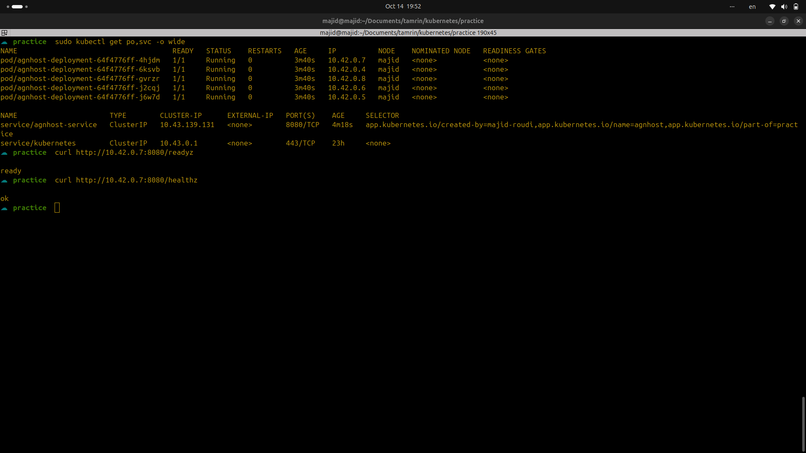

# Description

In the first step, I cloned the application source code from the Kubernetes GitHub repository :

    git clone https://github.com/kubernetes/kubernetes.git
    cd kubernetes/test/images/agnhost

and built the Docker image :

    docker build -t agnhost:local .
    docker tag agnhost:local majidroodi/agnhost:2.40

 Then, I pushed the image to my personal Docker Hub repository :

    docker push majidroodi/agnhost:2.40

I used rich labeling for better organization and traceability of resources :

    app.kubernetes.io/name: agnhost
    app.kubernetes.io/part-of: practice
    app.kubernetes.io/created-by: majid-roudi

In the deployment strategy section, I used **RollingUpdate** to ensure zero downtime during updates. To improve application startup and minimize downtime, I configured **maxSurge** to 2 and **maxUnavailable** to 1 — allowing two new pods to start before one old pod is terminated :

      strategy:
        type: RollingUpdate
        rollingUpdate:
          maxSurge: 2
          maxUnavailable: 1

Finally, I configured the resource requests and limits according to the deployment specification file :

              resources:
                requests:
                  memory: "256Mi"
                  cpu: "500m"
                limits:
                  memory: "256Mi"
                  cpu: "500m"

