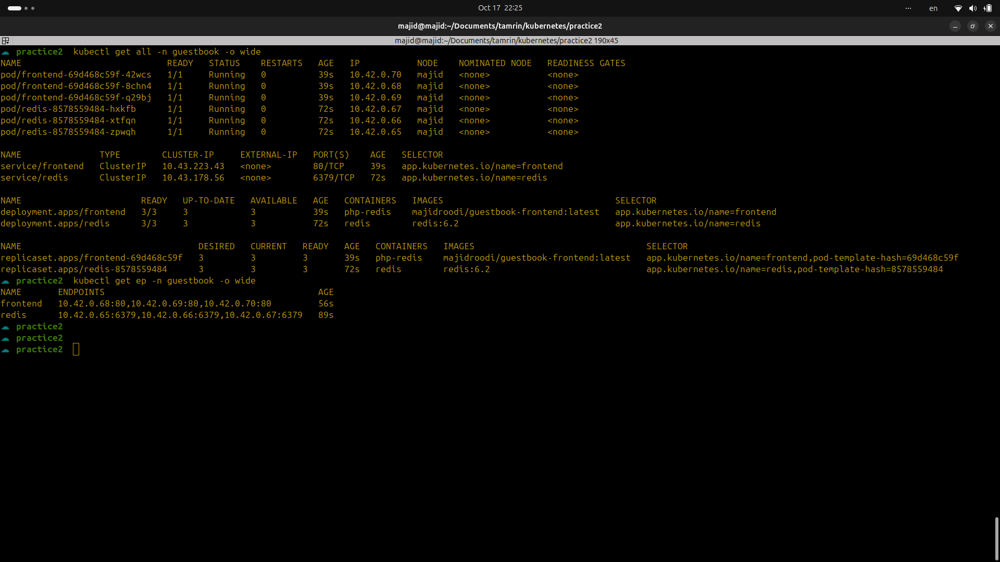

# PHP Guestbook with Redis - Production Deployment

## Deploy Steps

1. Create the namespace:
   
   ```bash
   kubectl apply -f namespace.yaml
   ```

Deploy Redis:

```bash
kubectl apply -f redis/ -n guestbook
```

Deploy Frontend:

```bash
kubectl apply -f frontend/ -n guestbook
```

Check resources:

```bash
kubectl get all -n guestbook
```

Notes

Redis stores data persistently using redis-pvc

Frontend and Redis communicate via internal DNS:

```bash
redis.guestbook.svc.cluster.local
```

Scaling frontend:

```bash
kubectl scale deployment/frontend --replicas=5 -n guestbook
```

Rolling updates with zero downtime
